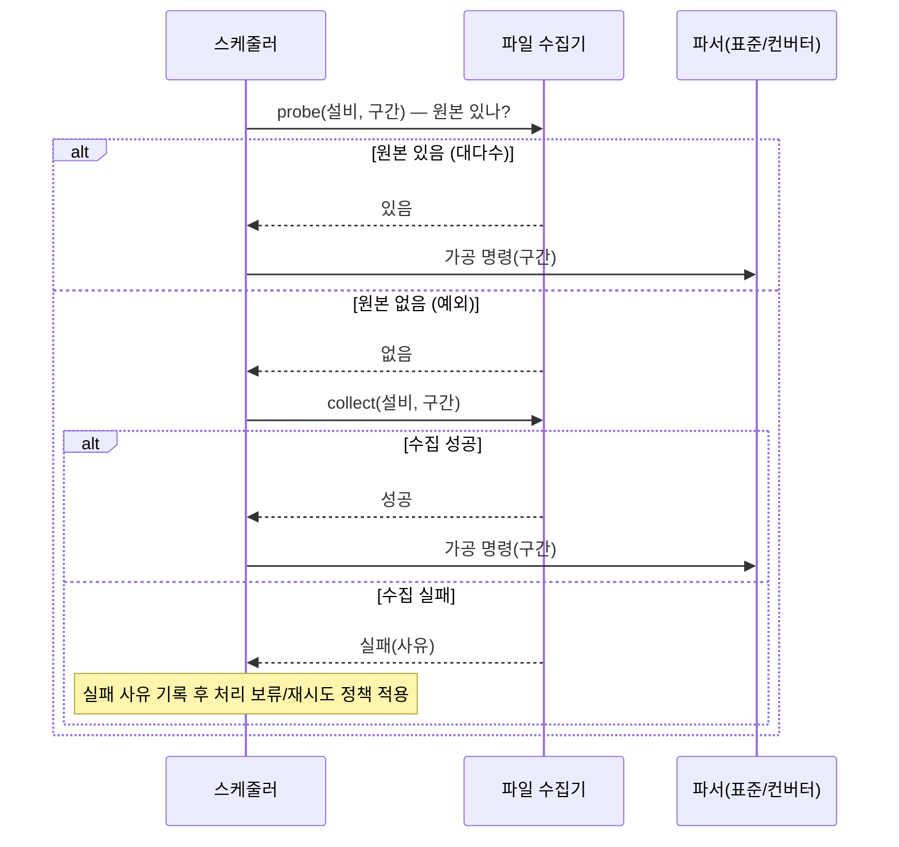

# 파일 수집기 (File Collector) 설계 문서

> 작성 목적: 「반도체 설비 이벤트 로그파서 개선 프로젝트」(이하 상위 문서)의 책임 분리 구조 중 **파일 수집기** 컴포넌트만 떼어내어, 그 책임 경계·인터페이스·동작을 구체화하기 위한 설계 자료.
>
> 본 문서는 상위 문서 `parser_project_revised.md`의 3.1②, 3.2, 9장을 근거로 하며, 상위 문서와 충돌하는 내용이 생기면 상위 문서를 우선한다.

---

## 0. 한 줄 정의

> **파일 수집기는 "원본을 확보하고, 그 가용성을 관리·통지하는" 재사용 가능한 일꾼이다. 가공 시나리오(live/rework/따라잡기)는 알지 않는다.**

수집기는 *무엇을·언제 수집할지 결정(정책)* 하지 않는다. 그 결정은 스케줄러가 한다. 대신 수집기는 *어떻게 확보·유지·정리할지의 메커니즘*을 온전히 소유한다. 즉 단순 다운로드 파이프(dumb pipe)가 아니라, 원본의 라이프사이클을 책임지는 컴포넌트다.

---

## 1. 배경: 왜 따로 떼어내는가

현재 파서는 설비 접근·로그 다운로드·오래된 파일 삭제·가공이 한 프로그램에 뒤섞여 있다(상위 문서 2.1). "수집"과 "가공"은 성격이 전혀 다른 일이다.

- **가공**은 시나리오에 종속된다. 같은 원본이라도 live로 처리할지, rework로 다시 처리할지, 하루치씩 따라잡을지에 따라 *무엇을 어떤 순서로* 처리할지가 달라진다.
- **수집**은 시나리오와 무관하다. "어떤 구간의 원본을 로컬에 확보한다"는 행위 자체는 그 파일이 이후 어디에 쓰이는지와 상관없이 동일하다.

이 둘을 분리하면 수집기를 **시나리오를 모르는 재사용 일꾼**으로 둘 수 있고, 시나리오 정책 변경이 수집 로직에 영향을 주지 않는다. 또한 병목은 파서이므로, 수집을 가공에 종속시키지 않고 독립적으로 선제 확보해 두는 편이 전체 처리량에도 유리하다(상위 문서 3.2).

---

## 2. 책임 경계 (Scope)

### 2.1 수집기가 하는 일 (In Scope)

| 책임 | 설명 |
|------|------|
| **원본 다운로드** | 설비(또는 원격 경로)에서 로그·Configuration 파일을 로컬 AP 서버로 가져온다. 부가 기능으로, 로컬에서 사용자가 직접 다운로드하는 수동 모드도 제공한다. |
| **오래된/stale 파일 삭제** | 보관 기간이 지난 파일, 더 이상 유효하지 않은 경로·파일을 정리한다. |
| **스냅샷 파일 정리** | Configuration처럼 시점 스냅샷 성격의 파일을 날짜별·수정시점별로 정해진 형식에 맞춰 정리·보관한다. |
| **변경 감지** | 해시값 등으로 Configuration 파일이 *실제로 변경된 시점*에만 가져온다. 불필요한 재수집을 막는다. |
| **가용성 관리·통지** | "이 (설비, 구간) 원본이 지금 로컬에 있는가 / 변경되었는가"를 관리하고, 스케줄러가 조회할 수 있도록 통지한다. |
| **재수집 명령 처리** | 스케줄러가 재수집을 명령하면 수행하고, 실패 시 실패 사유를 기록한다. |

### 2.2 수집기가 하지 않는 일 (Out of Scope — 스케줄러 책임)

| 비책임 | 누가 하는가 | 이유 |
|--------|------------|------|
| 시나리오 판단 (live/rework/따라잡기) | 스케줄러(정책 계층) | 시나리오는 "가공"의 축이다. 수집은 시나리오를 모른다. |
| "어떤 구간을 어떤 순서로" 산정 | 스케줄러(정책 계층) | 처리할 파일 구간 결정은 정책이다. |
| Config 변경 시 *가공할지 말지* 판단 | 스케줄러(정책 계층) | 수집기는 "변경됐다"는 사실만 통지한다. 변경 시 가공 또는 일 1회 강제 가공 여부는 스케줄러 정책이 정한다. |
| 원본 존재 확인 후 "수집할지/바로 파서 부를지" 분기 | 스케줄러 | 수집기는 명령받은 것을 수행할 뿐, 가공 흐름을 분기하지 않는다. |
| 가공·변환·정규화·보정 | 표준 파서 / 컨버터 / Config 파서 | 수집기는 원본을 건드려 가공하지 않는다. |

### 2.3 경계선 요약 그림

```mermaid
flowchart LR
    SCH[스케줄러<br/>정책: 무엇을·언제·어떤 순서로] -->|수집 명령<br/>(설비, 구간)| COL[파일 수집기<br/>메커니즘: 어떻게 확보·유지]
    COL -->|가용성·변경 상태 통지| SCH
    COL -->|원본 확보| FILES[(로그·Config 파일)]
    COL -->|stale 삭제| FILES
```

---

## 3. 설계 원칙

1. **시나리오 불가지(Scenario-agnostic)**: 수집기 코드 어디에도 live/rework/따라잡기라는 개념이 등장하지 않는다. 등장한다면 책임이 새고 있는 것이다.
2. **명령 기반(Command-driven)**: 수집기는 스스로 "지금 무엇을 수집할까"를 판단하지 않는다. 항상 스케줄러의 명령으로 움직인다. (live의 정기 수집조차 스케줄러가 트리거한다.)
3. **멱등성(Idempotent)**: 동일한 수집 명령을 두 번 받아도 결과가 같아야 한다. 이미 있고 변경되지 않은 원본은 다시 받지 않는다(해시 기반 변경 감지가 이를 뒷받침).
4. **상태는 통지하되 정책은 판단하지 않는다**: 수집기는 "있다/없다/변경됨"이라는 *사실(fact)* 만 제공한다. 그 사실로 무엇을 할지는 스케줄러의 몫이다.
5. **실패는 삼키지 않고 기록한다**: 수집 실패는 예외로 흘려보내지 않고, 사유와 함께 스케줄러가 읽을 수 있는 형태로 남긴다.

---

## 4. 입출력 인터페이스

수집기의 인터페이스는 **단방향 다운로드가 아니라 양방향**이다. 입력으로 명령을 받고, 출력으로 가용성·결과를 돌려준다. (구체 시그니처·자료형은 구현 시 확정. 아래는 개념 수준.)

### 4.1 입력 (스케줄러 → 수집기)

| 명령 | 입력 | 의미 |
|------|------|------|
| **수집 (collect)** | 설비 식별자, 대상 구간(시간 범위 등), 파일 종류(표준 로그/비표준 로그/Config) | 해당 구간의 원본을 로컬에 확보하라. 이미 있고 미변경이면 no-op. |
| **존재/가용성 조회 (probe)** | 설비 식별자, 대상 구간 | 이 원본이 지금 로컬에 있는가? 변경되었는가? |
| **정리 (cleanup)** | 보관 정책(기간 등) | 오래된/stale 파일을 정리하라. |

> 참고: 상위 문서 3.2에서 스케줄러는 **가공 전에 원본 존재 여부를 먼저 확인**하고, 있으면 바로 파서를, 없으면 그때 수집기에 수집을 명령한다. 위 `probe`/`collect`가 이 흐름을 받친다.

### 4.2 출력 (수집기 → 스케줄러)

| 출력 | 내용 |
|------|------|
| **가용성 상태** | 대상 구간 원본의 존재 여부, (Config의 경우) 직전 대비 변경 여부 |
| **수집 결과** | 성공/실패, (실패 시) 사유 — 예: 원격 접근 불가, 원본 없음, 권한 오류 |
| **정리 결과** | 삭제된 대상 요약 (선택) |

### 4.3 인터페이스 불변식

- 수집 명령의 입력에는 **시나리오가 들어오지 않는다.** 들어오는 것은 "어떤 설비의 어떤 구간"뿐이다.
- 같은 (설비, 구간)에 대한 `probe`는 부작용이 없어야 한다(읽기 전용).

---

## 5. 주요 동작 상세

### 5.1 변경 감지 (Configuration)

Configuration은 스냅샷 성격이라 매번 받으면 낭비이고, 변경 시점 추적도 어렵다.

- 원격 파일의 해시(또는 동등한 지문)를 직전 보관본과 비교한다.
- **변경된 경우에만** 새 스냅샷으로 가져와 날짜별/수정시점별 형식으로 정리한다.
- 수집기는 "변경됨"이라는 사실을 통지한다. **변경 시 즉시 가공할지, 일 1회 강제 가공할지는 스케줄러 정책**이며 수집기는 관여하지 않는다.

### 5.2 stale 정리

- 보관 기간이 지난 로그, 더 이상 가리키는 대상이 없는 경로/파일을 정리한다.
- 단, "rework 대상이 될 수 있는 구간"을 섣불리 지우지 않도록 보관 기간은 rework 가능 기간보다 길게 잡는다(상위 문서 3.2: 파일 유지 기간이 rework 기간보다 길어, rework 대상 원본은 거의 항상 로컬에 존재). 구체 보관 정책은 스케줄러/정책 측에서 내려준다.

### 5.3 재수집 (예외 케이스 흡수)

서버 이전 등으로 구 서버 로그가 신 서버로 넘어오지 않은 상태에서 rework가 필요한 경우가 있다. 이를 별도 시나리오로 복잡하게 만들지 않고, 공통 경로로 흡수한다(상위 문서 3.2):

```
원본 존재 여부 확인(probe) → 없으면 수집 명령(collect) → 수집 실패 시 실패 사유 기록
```

수집기 입장에서 이는 "평범한 collect 명령"일 뿐이다. "재수집"이라는 특별한 개념을 수집기가 알 필요가 없다.

---

## 6. 스케줄러와의 상호작용 흐름

가공 직전, 스케줄러가 원본을 확보하는 표준 흐름:



핵심: **분기(있으면 파서, 없으면 수집)는 스케줄러가 한다.** 수집기는 `probe`/`collect`에 사실로만 응답한다.

---

## 7. 범위 및 단계 계획

상위 문서 9장에 따라, 올해 MVP에서 수집기는 **최소 기능만** 만든다. 가공 로직(컨버터+표준 파서) 신규 구축·검증이 MVP의 핵심이고, 수집기는 이를 구동할 최소한으로 한정한다.

### 7.1 올해 (MVP) — 최소 기능

- 명령받은 (설비, 구간) 원본 **다운로드**
- 원본 **존재/가용성 확인(probe)**
- 수집 **성공/실패 결과 통지**

> 이 범위만으로도 "스케줄러가 원본을 확보해 파서를 돌린다"는 핵심 흐름이 성립한다.

### 7.2 차후 (고도화)

- 오래된/stale 파일 정리
- Configuration 스냅샷 관리
- 해시 기반 변경 감지
- 재수집 명령 대응의 정교화 (실패 분류·재시도 등)

### 7.3 MVP에서의 설계 태도

고도화 기능을 지금 구현하지는 않되, **인터페이스에 미래 자리를 비워 둔다.** 예컨대 collect/probe의 입력에 파일 종류를 받아 두어 Config 변경 감지가 나중에 자연스럽게 들어올 수 있게 하고, 수집기 안에 시나리오 개념이 새어 들어오지 않도록 경계를 처음부터 지킨다.

---

## 8. 미정 사항

| 항목 | 현재 방향 | 추가 검토 필요 |
|------|-----------|----------------|
| **가용성 상태 저장 위치** | 스케줄러가 조회 가능해야 함 | DB(SSOT) 중앙화 범위 vs 수집기 로컬 — 상위 문서 4.1 상태 중앙화와의 정합 |
| **보관 기간 정책** | rework 가능 기간보다 길게 | 파일 종류별 구체 기간, 누가 값을 소유하는가 |
| **변경 감지 지문 방식** | 해시 등 | 해시 대상(전체/부분), 비용, 충돌 처리 |
| **수집 실패 분류·재시도** | 실패 사유 기록 | 재시도 주체(수집기 자체 vs 스케줄러), 백오프 정책 |
| **비표준 carryover 파일** | 현재 파일로 관리됨(상위 문서 2.5) | 수집기 책임에 포함할지, 별도 관리할지 — 상위 문서 10장 carryover 저장 방식과 연동 |

---

> *본 문서는 상위 문서와 함께 갱신된다. 수집기 인터페이스가 구현으로 확정되면 4장의 개념 시그니처를 실제 시그니처로 보강한다.*
