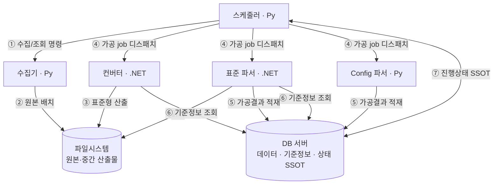

# 컴포넌트 간 통합·인터페이스 계약 설계 문서

> 작성 목적: 「반도체 설비 이벤트 로그파서 개선 프로젝트」의 책임 분리 구조에서, **각 컴포넌트를 독립적으로(그리고 서로 다른 언어로) 개발하더라도 인터페이스·기술 호환성이 어긋나지 않도록**, 컴포넌트 간에 흐르는 정보와 합의해야 할 계약을 아키텍처 레벨로 정의하는 자료.
>
> 근거: 상위 문서 `parser_project_revised.md`(3.1, 3.2, 4.1, 4.3), 짝 문서 `file_collector_design.md`, `scheduler_design.md`. 충돌 시 상위 문서 우선.
>
> **이 문서의 위치**: "무엇을 합의해야 하는가(계약의 항목과 규약)"를 정한다. 실제 시그니처·스키마 컬럼 등 구현 확정값은 각 컴포넌트 개발 시 이 계약을 채워 넣는다.

---

## 0. 전제: 언어 구성 (폴리글랏)

성능 부하가 가장 큰 가공 로직은 .NET으로, 개발 속도가 중요한 조정·수집 계열은 Python으로 둔다.

| 컴포넌트 | 언어(가정) | 성격 |
|----------|-----------|------|
| **표준 로그 파서** | .NET | CPU 바운드 핵심 가공 |
| **컨버터** | .NET | CPU 바운드 핵심 가공 |
| **스케줄러** | Python | 조정·정책·분배 |
| **파일 수집기** | Python | 원본 확보·가용성 |
| **Configuration 파서** | Python | 별도 가공(부하 작음) |

**이 구성이 성립하는 전제**: 컴포넌트 경계가 *언어 중립적*이어야 한다 — 객체를 직접 넘기지 않고, **프로세스 호출 / 파일 / DB / (고도화 시) 네트워크 프로토콜**로만 주고받는다. 따라서 본 문서가 정의하는 모든 계약은 언어와 무관한 표현(바이트·텍스트·스키마)으로 기술한다.

> **핵심 위험**: 폴리글랏의 버그는 대부분 "기능"이 아니라 **표현 차이**에서 난다 — 인코딩, 줄바꿈, 소수점, 타임존, null 표현, TSV 이스케이프 등. 5장에서 이를 체크리스트로 못 박는다.

---

## 1. 컴포넌트 상호작용 맵

번호는 2장의 통합 지점(Integration Point)에 대응한다.

---

## 2. 통합 지점별 계약

각 지점마다 **전송 방식(transport) / 입력 / 출력 / 실패 표현**을 합의한다. 언어가 다르므로 "함수 시그니처"가 아니라 "교환되는 정보의 형태"로 정의한다.

### ① 스케줄러(Py) → 수집기(Py): 수집/조회 명령

같은 Python이라 결합이 가장 쉽지만, **경계는 그대로 굵게(coarse-grained) 유지**한다(나중에 분리·재구현 대비).

| 항목 | 계약 |
|------|------|
| 전송 | MVP: 함수/모듈 호출 또는 CLI. (고도화 시에도 job 단위 유지) |
| 입력 — probe | 설비 식별자, 대상 구간, 파일 종류 |
| 입력 — collect | 위와 동일 (+ 강제 재수집 여부) |
| 입력 — cleanup | 보관 정책(기간 등) |
| 출력 — probe | 존재 여부, (Config) 변경 여부 |
| 출력 — collect | 성공/실패 + 실패 사유 코드 |
| 실패 표현 | 4.5의 공통 에러 코드 체계 |

> 시나리오(live/rework/따라잡기)는 **입력에 포함되지 않는다** — 수집기는 시나리오를 모른다(`file_collector_design.md` §4.3).

### ② 수집기(Py) → 파일시스템: 원본 배치 규약

수집기가 쓰고 컨버터/파서(.NET)가 읽으므로, **경로·네이밍·원자성**을 양측이 동일하게 약속해야 한다. 여기서 어긋나면 .NET이 파일을 못 찾거나 반쯤 쓰인 파일을 읽는다.

| 항목 | 계약 |
|------|------|
| 경로 규약 | (설비/공정/날짜/시) 기반의 결정적 디렉터리 구조 — 한쪽이 계산한 경로를 다른 쪽이 동일하게 재현 가능해야 함 |
| 파일 네이밍 | 설비·시간 구간을 파일명에서 파싱 가능하게. 구분자·자릿수·시간 포맷 고정 |
| 시간 표현 | 4.4 타임존/포맷 규약 준수 (파일명·경로의 시각 포함) |
| **쓰기 원자성** | 임시 파일에 쓴 뒤 원자적 rename으로 노출 (reader가 미완성 파일을 읽지 않도록). 또는 완료 마커 파일 |
| 가용성 신호 | "이 구간 원본이 준비됨"을 어떻게 알리나 — 파일 존재 + DB 상태 중 무엇이 기준인지 명시 |

### ③ 컨버터(.NET) → 파일시스템 → 표준 파서(.NET): 표준형 산출

컨버터가 비표준을 **표준 로그 스펙 형식**으로 변환해 내놓고, 표준 파서가 이를 읽는다. 둘 다 .NET이라 언어 호환은 쉽지만, **"표준 로그 스펙"이 단일 소스로 고정**되어야 한다(4.1).

| 항목 | 계약 |
|------|------|
| 포맷 | 표준 로그 스펙 = TSV(txt). 컬럼 순서·의미·필수여부를 스펙 문서가 단독 소유 |
| 산출 위치/네이밍 | ② 규약 재사용 (표준 파서가 동일 규칙으로 찾음) |
| 정규화/보정 책임 | **컨버터는 형식 변환만**, 로그 값 정규화·보정은 표준 파서 도메인 내부에서(상위 문서 3.1③·④). 책임이 양쪽에 새지 않도록 명시 |

### ④ 스케줄러(Py) → 컨버터/파서(.NET): 가공 job 디스패치  ★언어 경계

**Python ↔ .NET 경계의 핵심 지점.** 여기가 폴리글랏 호환의 본진이다. 모델을 단계로 나눈다.

| 단계 | 전송 | 특징 |
|------|------|------|
| **MVP (A 모델)** | 스케줄러가 .NET 실행 파일을 **CLI로 spawn** (인자/표준입력으로 job 전달), **exit code + 산출물(파일/DB)** 로 결과 확인 | 단순·견고. 연결 관리 없음. 프로세스 죽으면 exit code로 감지 |
| **고도화 (B 모델)** | 상주 워커 + **gRPC**(양방향 스트리밍으로 실시간 진행 보고) 또는 **메시지 큐**(pull 기반 self-balancing) | 실시간 진행·job 개수 파악, 동적 부하 분산(4.2)에 적합 |

**A→B 전환을 쉽게 하려면**: job의 **논리적 단위와 페이로드 형태를 처음부터 동일**하게 잡는다. CLI 인자든 gRPC 메시지든 "같은 job"을 표현하도록.

job 페이로드(전송 방식 무관)에 들어가야 할 정보:

- 설비 식별자, 대상 구간, 파일 종류
- 입력 원본 위치(② 규약), 산출 위치
- (rework 등) 처리 모드 힌트가 필요하면 — 단, **파서는 시나리오를 모른다**(`scheduler_design.md` §4). 파서가 알아야 하는 건 "이 입력을 가공하라"뿐. rework의 삭제/재적재는 스케줄러가 DB에서 처리.

**B 모델 도입 시 추가 합의** (gRPC 택할 경우):
- `.proto` 스키마 = 스케줄러↔워커 데이터 계약의 **단일 소스** (Py·.NET 양쪽이 여기서 코드 생성 → 포맷 어긋남 원천 차단)
- 진행 보고 스트림 항목: job ID, 상태(수신/진행/완료/실패), 진행률(선택)
- **워커 크래시 시맨틱**: 도중 사망 시 job 재배포 규칙 (큐면 ack/visibility-timeout, gRPC면 하트비트+재할당)

### ⑤ 컨버터/파서(.NET) → DB: 가공결과 적재  ★언어 경계

.NET이 Python 측이 만든 DB 스키마에 직접 쓴다. **DB가 폴리글랏의 공용 계약 지점**이 된다.

| 항목 | 계약 |
|------|------|
| 접근 방식 | .NET DB 드라이버로 직접 적재. 스키마는 단일 소스(4.1) |
| 트랜잭션/원자성 | "가공 완료 = DB 커밋"을 진실로. 부분 적재 방지 |
| 중복/재적재 | rework 시 삭제 후 재적재 / upsert — **정책은 스케줄러**, 실행 규약은 합의 필요(미정, 7장) |
| 문자셋 | DB·드라이버·연결 charset을 UTF-8로 통일 (5장) |

### ⑥ 컨버터/파서(.NET) → DB: 기준정보 조회

설비/모델/공정 매핑, 모듈 타입·alias 등 기준정보를 .NET이 읽는다.

| 항목 | 계약 |
|------|------|
| 스키마 안정성 | 기준정보 테이블 구조가 곧 계약. 상위 문서 3.3의 DB 정규화와 연동 |
| 값 형식 일관성 | 단일 값 vs 리스트 혼용 금지(상위 문서 2.4) — .NET 파싱이 깨짐 |
| 캐싱/리프레시 | 기준정보 변경이 가공에 반영되는 시점 규약 (선택) |

### ⑦ 스케줄러(Py) ↔ DB: 진행상태 SSOT

진행 상황의 **단일 진실 원천은 DB**이고, 스케줄러는 읽고 쓰는 주체일 뿐 상태를 자체 보유하지 않는다(상위 문서 4.1·4.3, `scheduler_design.md` §6).

| 항목 | 계약 |
|------|------|
| 상태 테이블 | 설비별 "어디까지 처리했는지" — 스키마는 미정(7장) |
| 쓰기 주체 | 스케줄러가 유일한 정상 쓰기 주체 지향 |
| 이중 진실 금지 | B 모델의 소켓/스트림 진행 정보는 **휘발성 신호**일 뿐, 확정 상태는 DB. (`scheduler_design.md` §5.1) |

---

## 3. 통신 방식 요약 (전송 계층)

| 지점 | MVP | 고도화 |
|------|-----|--------|
| ① 스케줄러→수집기 | 호출/CLI | 동일(job 단위 유지) |
| ②③ 파일 핸드오프 | 파일시스템 + 원자적 rename | 동일 |
| ④ 스케줄러→파서/컨버터 | **CLI spawn + exit code** | **gRPC 스트리밍** 또는 **메시지 큐(pull)** |
| ⑤⑥ .NET↔DB | DB 드라이버 직접 | 동일 |
| ⑦ 스케줄러↔DB | DB 드라이버 직접 | 동일 |

**원칙**: raw 소켓을 직접 구현하지 않는다. B 모델은 gRPC(직접 RPC·스트리밍·`.proto` 계약) 또는 메시지 큐(부하 self-balancing·크래시 복원) 중 택일. 스케줄러·워커가 동일 AP 서버에 상주하면 Unix 도메인 소켓/localhost로 충분하고, 여러 서버에 걸치면 네트워크 브로커를 고려한다.

---

## 4. 횡단 계약 (Cross-Cutting Contracts)

전 컴포넌트가 공통으로 따라야 하는 규약. **여기가 폴리글랏 호환의 실제 승부처다.**

### 4.1 데이터 포맷의 단일 소스 (Single Source of Schema)

컴파일 타임에 타입을 공유할 수 없으므로, 형식은 **문서/스키마 파일을 단일 소스로 두고 양 언어가 그것을 따른다.**

- **표준 로그 TSV 스펙**: 컬럼 순서·이름·타입·필수여부·의미. (③에서 컨버터가 쓰고 파서가 읽음)
- **DB 스키마**: 결과 테이블·기준정보·상태 테이블. (⑤⑥⑦)
- **(B 모델) job/진행 메시지**: gRPC면 `.proto`가 곧 단일 소스.
- **carryover 포맷**: 파일 경계 전달 정보(상위 문서 10장 미정).

> 안전망: **골든 파일 테스트(상위 문서 5.1)** 가 이 계약을 입출력으로 검증한다 — 언어가 달라도 동작.

### 4.2 식별자·구간 규약

- **설비 식별자**: 표기·자릿수·대소문자 규칙 통일.
- **시간 구간 표현**: 경계 포함 규칙을 **반열림 `[start, end)`** 등 하나로 고정 (off-by-one·중복 적재 방지).
- **파일 종류 enum**: 표준 로그 / 비표준 로그 / Configuration 의 코드값 통일.

### 4.3 인코딩·줄바꿈·TSV 이스케이프  ★폴리글랏 최다 함정

| 항목 | 계약(권장) |
|------|-----------|
| 문자 인코딩 | **UTF-8**로 통일. **BOM 유무를 명시**(권장: BOM 없음). .NET이 BOM 붙여 쓰면 Python이 첫 컬럼을 오인할 수 있음 |
| 줄바꿈 | **LF 고정** (CRLF 혼입 금지). .NET 기본이 CRLF가 될 수 있으니 명시 |
| 필드 구분 | TSV = 탭. 값 안의 탭/개행을 어떻게 처리할지(이스케이프 or 금지) 규약화 |
| 따옴표/이스케이프 | TSV에 따옴표 규칙이 다를 수 있음 — 양측 동일 규약 |
| 빈 값/Null | "빈 문자열"과 "Null"을 어떻게 구분 표기하는지 고정 |

### 4.4 시간·타임존

- **타임존 기준 통일**: 저장·전송은 UTC(또는 명시된 단일 TZ)로. 로컬 변환은 표시 단계에서만.
- **시각 포맷**: ISO-8601 등 하나로. (파일명용 축약 포맷이 따로 있으면 그것도 명시)
- **주의**: .NET `DateTime`(Kind/`DateTimeOffset`)과 Python `datetime`(naive/aware)의 직렬화가 다르다 — 문자열 표현을 계약으로 고정해 양쪽 파싱을 일치시킨다.

### 4.5 에러·상태 코드 규약

- **공통 실패 사유 코드 집합**: 수집 실패·가공 실패의 사유를 코드로 표준화(원격 접근 불가/원본 없음/권한/포맷 오류 등).
- **CLI(A 모델) exit code 매핑**: 0=성공, 그 외=사유. 표준에러로 상세 메시지.
- **부분 실패**: "일부 라인 실패"를 어떻게 보고/기록하는지.

### 4.6 숫자·로케일

- **소수점**: `.` 고정 (로케일에 따라 `,`가 되는 사고 방지). .NET `ToString`은 로케일 의존이므로 **InvariantCulture 강제** 합의.
- **천 단위 구분자 금지**, 숫자 정밀도(부동소수/정수) 규약.

### 4.7 로깅·관측 (선택, 권장)

- 컴포넌트 공통 **상관 ID(correlation/job ID)** 를 로그에 포함해, 폴리글랏 경계를 넘는 한 job의 흐름을 추적 가능하게.

---

## 5. 기술 호환성 체크리스트 (Py ↔ .NET)

각 컴포넌트 팀이 개발 착수 전 합의했는지 확인할 항목.

- [ ] 파일/DB/메시지 **인코딩 UTF-8 + BOM 정책** 일치
- [ ] 텍스트 **줄바꿈 LF** 고정
- [ ] **TSV 구분자·이스케이프·빈값/Null** 표기 일치
- [ ] **타임존(UTC)·시각 문자열 포맷** 일치, .NET/ Python datetime 직렬화 합의
- [ ] **소수점·로케일(InvariantCulture)·숫자 정밀도** 일치
- [ ] **설비 식별자·시간 구간 경계 규칙** 일치
- [ ] **파일 경로·네이밍 규약**을 양 언어가 동일하게 생성/파싱
- [ ] 파일 **쓰기 원자성**(임시→rename / 완료 마커) 합의
- [ ] **DB 스키마·연결 charset·드라이버** 확정, 단일/리스트 값 형식 일관
- [ ] **에러 코드·exit code 매핑** 표준화
- [ ] (B 모델) **`.proto`/메시지 스키마 단일 소스**, 크래시 시 job 재배포 규칙

---

## 6. 계약 변경 관리

독립 개발에서 가장 위험한 건 "한쪽이 계약을 말없이 바꾸는 것". 다음을 둔다.

- **단일 소스 위치 명시**: 표준 TSV 스펙·DB 스키마·(B 모델)`.proto`가 어디에 있는지 저장소 경로로 고정.
- **버전 표기**: 포맷/스키마에 버전을 둬, 호환 깨짐을 감지.
- **변경 시 골든 테스트 갱신**: 계약 변경은 반드시 골든 파일 테스트(5.1) 갱신과 함께. CI에서 양 언어 산출물 비교(상위 문서 5.6).

---

## 7. 미정 사항

| 항목 | 비고 |
|------|------|
| 표준 로그 TSV 스펙의 컬럼 확정값 | 별도 스펙 문서로 단일 소스화 |
| DB 결과/상태/기준정보 스키마 | 상위 문서 3.3·4.1과 연동 |
| ④ B 모델 채택 시 gRPC vs 메시지 큐 | 동일 호스트 여부·서버 수에 따라 결정 |
| rework 시 DB 재적재 방식(삭제·upsert) | 상위 문서 10장 |
| carryover 저장·전달 포맷 | 상위 문서 10장 |
| 상관 ID 체계·로깅 표준 | 관측 도입 범위 |

---

> *본 문서는 상위 문서 및 `file_collector_design.md`·`scheduler_design.md`와 함께 갱신된다. 각 통합 지점의 구현이 확정되면 2·4장의 "계약 항목"을 실제 값(스키마·시그니처·`.proto`)으로 채운다.*
