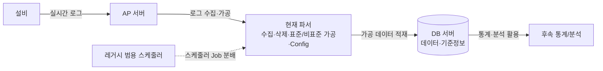
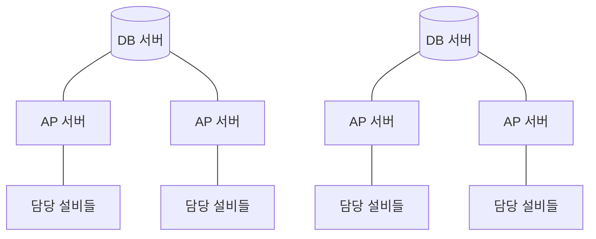
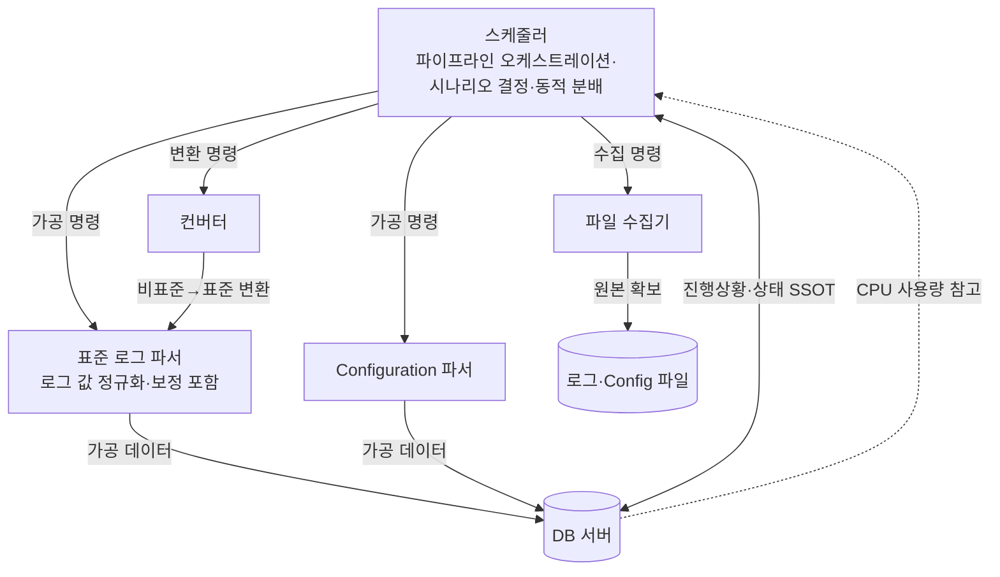

# 반도체 설비 이벤트 로그파서 개선 프로젝트

> 작성 목적: 함께 일하는 동료와 관련 실무자에게 프로젝트의 배경, 실행 방향, 단계별 범위, 미정사항을 공유하기 위한 설명 자료

---

> 본 문서는 프로젝트 승인 요청서라기보다, 실무자가 실제로 어떤 방향으로 개선을 진행할지 설명하기 위한 실행 방향 공유 자료이다. 최종적으로 가려는 전체 구조는 개요 수준으로 설명하되, 상세 실행 범위는 올해 MVP를 중심으로 정리한다.

---

## 0. 용어 정의

| 용어 | 설명 |
|------|------|
| **표준 로그 스펙** | 우리 회사 내부에서 정한 표준 로그 양식. 설비사에 해당 스펙을 전달하고, 설비가 이 양식에 맞춰 로그를 생성하도록 요청한다. 실시간 동작 start/end, 로봇·공정·랏 진행·설비 function·파라미터 등 설비 전반의 정보를 담는다 |
| **표준 로그** | 우리 회사 내부 표준 로그 스펙을 준수해 생성된 로그. TSV 형식의 txt 파일로 저장되며, 시간 단위로 압축 보관된다 |
| **비표준 로그** | 설비사가 자체 양식으로 생성하는 실시간 로그. 설비사마다 형식이 달라, 활용 가능한 데이터로 만들려면 별도의 변환 로직이 필요함 |
| **기타 Configuration** | 설비 파라미터 등 표준/비표준 로그 외의 정보를 담은 별도 파일. 역시 설비사별로 양식이 달라 각각 별도 로직으로 가공 필요 |
| **DB 서버** | 데이터 저장 및 기준정보를 보유한 서버. 각 DB 서버가 여러 공정의 데이터를 저장하며, 여러 AP 서버를 관리 |
| **AP 서버** | 실제 앱이 실행되는 서버. 설비에 접근해 로그를 수집하고, 파서가 데이터를 가공하여 담당 공정의 DB 서버에 적재 |
| **스케줄러 Job** | 스케줄러 관점에서 파서가 처리해야 하는 설비 단위 작업 |
| **로그상 Job** | 로그 내용상 하나의 lot이 설비에서 진행하는 작업 단위. 스케줄러 Job과 의미가 다르므로 구분해서 사용한다 |
| **레거시 스케줄러** | DB 서버로부터 해당 AP 서버에 맞는 스케줄러 Job(가공할 설비 정보 리스트) 전체를 받아 각 프로세스에 분배하는 모듈 |
| **Carryover** | 로그 파일이 시간 단위로 분리되기 때문에 start와 end가 서로 다른 파일에 나뉘어 존재할 수 있다. 이때 다음 파일 가공 시점으로 전달해야 하는 이전 파일의 미완료 동작 정보나 흐름 정보를 의미한다 |
| **로그 값 정규화 (Value Normalization)** | 설비사·모델마다 제각각인 표현(alias, 코드 체계, 모듈 타입 등)을 일관된 표준 형태로 통일하는 단계. "틀린 것을 고친다"기보다 "제각각인 것을 같은 기준으로 정렬한다"에 가까움 |
| **DB 스키마 정규화 (DB Normalization)** | 기준정보 테이블의 중복·혼재를 줄이고, 단일 값/리스트 혼용 등 구조적 문제를 정리하는 DB 설계 관점의 정규화 |
| **보정 (Correction·Enrichment)** | 로그 자체의 결함을 메우는 단계. 흐름 추적으로 누락된 정보를 채우고(보강), 잘못된 값을 교정(수정)함. 로그 값 정규화와는 층위가 다른 별개 단계 |
| **단계별 전환** | 레거시 전체를 한 번에 교체하기보다, 핵심 가공 경로를 먼저 신규 구조로 구축·검증하고 이후 운영 기능을 단계적으로 고도화하는 전환 방식 |

---

## 1. 배경 및 개요

### 1.1 추진 배경

설비 이벤트 로그파서는 설비가 실시간으로 남기는 방대한 로그를, 사람이 분석하고 활용할 수 있는 정형 데이터로 바꿔 주는 핵심 데이터 파이프라인이다. 이 데이터는 설비·공정·랏의 진행 상황을 파악하고, 이후 통계와 분석의 기반이 되므로, 파서의 안정성과 정확성은 곧 후속 데이터 전반의 신뢰도와 직결된다.

그러나 현재 파서는 오랜 기간 운영되며 다음과 같은 한계에 부딪혔다.

- **구조적 한계**: 수집·삭제·표준/비표준 가공·Configuration 처리 등 성격이 다른 역할이 하나의 프로그램에 뒤섞여 있고, 로그 값 정규화·보정 로직마저 여러 곳에 흩어져 있어 유지보수와 버그 추적이 어렵다.
- **레거시 부채**: 인수인계가 미흡한 저품질 레거시 코드에 테스트 코드까지 없어, 수정과 배포가 개인의 경험에 크게 의존한다.
- **운영 부담**: 재처리·따라잡기 등 다양한 운영 시나리오를 자동으로 처리하지 못해 사람의 수작업과 실수가 잦고, 순간 부하 피크로 서버 오류가 발생하는 등 자원 활용도 비효율적이다.
- **변화하는 요구**: 설비 동작과 로그가 갈수록 복잡해지는데, 현재 구조로는 이를 따라가기 어렵다.

설비와 로그의 복잡도가 계속 높아지는 상황에서 이 부채를 방치하면 대응 한계가 더 빨리 찾아온다. 변화가 시급한 지금 시점에, 레거시를 점진적으로 수선하기보다 **책임이 명확히 분리된 새 구조로 재설계**하여 장기적인 유지보수성·확장성·운영 효율을 확보하고자 한다.

### 1.2 파서 개요

설비 이벤트 로그파서는 단순히 동작 단위로 로그를 묶는 도구가 아니다. 설비·랏·웨이퍼의 전반적인 흐름을 추적하여, 각 로그에 부족한 정보를 채우거나 여러 로그를 합쳐 새로운 정보를 생성하는 역할까지 수행한다. 표준 로그 스펙이 완벽하지 않을뿐더러, 설비사별로 로그 품질 차이가 존재하기 때문이다.

실시간 로그는 동작 시작 시점(start)과 종료 시점(end)이 서로 다른 라인으로 기록되므로, 파서는 이를 합쳐 하나의 분석 가능한 데이터로 만든다.

**전체 데이터 흐름 (현재)**

**서버 구성**

> 각 DB 서버는 여러 공정의 데이터·기준정보를 저장하며 여러 AP 서버를 관리하고, 각 AP 서버는 담당 설비에 접근해 로그를 수집·가공하여 해당 공정의 DB 서버에 적재한다. 전체적으로 총 O개의 DB 서버와 OO개의 AP 서버가 존재하며, 그만큼 관리 포인트가 많다. *(서버 수는 추후 확정)*

---

## 2. 현재 파서의 문제점

현재 운영 중인 파서는 오랜 기간 누적된 구조적·운영적 부채를 안고 있다. 문제를 성격별로 6개 그룹으로 정리하면 다음과 같다.

### 2.1 단일 프로그램에 과도하게 집중된 책임

하나의 프로그램이 너무 많은 역할을 떠안고 있다. 설비 접근 및 로그 파일 수집, 오래된 로그 파일 삭제, 표준·비표준 이벤트 로그 가공, 그 외 기타 Configuration 파일 가공까지 — 성격이 다른 작업들이 한 프로그램 안에 뒤섞여 있다. 책임이 분리되지 않아 한 영역의 변경이 다른 영역에 영향을 주기 쉽고, 전체 구조를 파악하기 어렵다.

### 2.2 레거시 코드 품질 및 유지보수·테스트의 어려움

- **인수인계 부족과 낮은 코드 품질**: 비표준 로직과 기타 파일 처리 로직은 과거에 작성된 뒤 인수인계가 미흡했고, 코드 품질 이슈까지 겹쳐 유지보수가 어렵다.
- **복잡해지는 설비에 대한 대응 한계**: 설비 동작이 복잡해지고 그에 따라 로그도 복잡해지면서 현재 파서 기능으로는 대응이 어려운 부분이 생기고 있다. 그러나 코드 품질이 낮은 레거시인 데다 운영 중인 파서라 수정 자체가 어렵다.
- **테스트 코드 부재**: 테스트 코드가 없어 배포 전 검증을 개인의 경험에 의존해야 한다.
- **테스트하기 어려운 구조**: 함수 하나의 크기가 크고 추상화가 되어 있지 않아, 코드 자체가 테스트에 적합하지 않다.

### 2.3 로그 값 정규화·보정 로직의 산재

표준 이벤트 로그라 하더라도 결함이 많다. 그래서 가공에 앞서 두 가지 처리가 필요하다. 하나는 설비사·모델마다 제각각인 표현을 일관된 형태로 통일하는 **로그 값 정규화(value normalize)**이고, 다른 하나는 누락된 정보를 채우거나 잘못된 값을 고치는 **보정(correction·enrichment)**이다. 이 둘은 역할이 다른 별개의 단계다.

이상적으로는 보정 전담 모듈(`corrector`)이 이 처리를 담당해야 하지만, 실제로는 가공 로직(start/end 병합, 분석 가능한 형태로의 변환 등) 안에도 예외처리 형태로 로그 값 정규화·보정이 섞여 들어가 있다. 그 결과 관련 로직이 DB, 보정 모듈, 가공 모듈 등 여러 곳에 흩어져 있어, 버그 발생 시 원인 추적이 어렵다. 또한 모델별·설비사별 보정 로직은 합쳐서 50종 이상에 이른다.

### 2.4 기준정보 설계 및 활용의 미흡

기준정보(설비/모델/공정 식별·매핑 마스터 데이터, 메이커·모델별 로그 값 정규화에 필요한 모듈 타입·alias 정보 등)의 DB 스키마 정규화(normalization)가 부족하다. 같은 테이블에 여러 정보가 혼재하거나, 값의 형식이 어떤 것은 단일 값·어떤 것은 리스트인 등 제1정규형 수준의 문제가 존재한다. 또한 파서에서 기준정보를 활용하는 부분이 확장성을 고려하지 않아, 간단한 기준정보 수정조차 직관적이지 않고 복잡하다. 즉, 단순 수정에도 러닝커브가 존재한다.

### 2.5 스케줄링·재처리·Carryover 운영의 수작업 의존

- **범용 스케줄러의 한계**: 현재 스케줄러는 파서 전용이 아니라 범용 스케줄러다. 레거시이고 인수인계도 제대로 되지 않아 파서에 적합하게 수정하기 어렵다.
- **다양한 운영 시나리오 대응 불가**: 파서가 특정 파일 처리 전 carryover 데이터를 DB에 저장하긴 하지만, 구조상 재처리나 하루치씩 순차 가공 등 다양한 시나리오에 대응하기 어렵다. 그 결과 사람이 DB의 진행 내용을 직접 업데이트·삭제하는 수작업이 필요하고, 이 또한 경험에 의존해 실수가 잦다.
- **비표준 로그의 더 큰 복잡성**: 비표준 로그의 경우 carryover가 사실상 DB에 저장되지 않고 파일로 관리된다. 그래서 직접 AP 서버에 원격 접속해 파일을 삭제하는 등 표준 대비 운영이 훨씬 복잡하다.
- **Configuration의 파일 기반 관리**: 기타 Configuration 역시 DB가 아니라 각 AP 서버에 파일로 존재한다. 상태가 DB에 중앙화되어 있지 않고 서버마다 흩어진 파일로 관리되다 보니, 운영 시나리오를 변경하기가 한층 더 어렵다.

> *추가 문제점이 더 도출될 수 있으며, 발견 시 본 섹션에 보강 예정*

### 2.6 성능 및 서버 자원 활용의 비효율

- **순간 부하 피크로 인한 서버 오류**: 현재 구조는 한 번 돌 때 전체 스케줄러 Job을 한꺼번에 처리하기 때문에 순간적으로 부하가 피크를 찍는다. 이로 인해 AP·DB 서버가 부하를 견디지 못하고 오류가 발생할 때가 있다.
- **정적인 부하 제어**: 프로세스별 thread 개수로 부하를 조절하긴 하지만, 동적 제어가 아니라 설정값 기반이다. 그래서 서버마다 일일이 값을 조정해줘야 하고, 부하 상황 변화에 맞춰 유연하게 대응하지 못한다.
- **낮은 서버 사용 효율**: 처음 피크를 친 이후에는 사용량이 급격히 떨어진다. 자원을 짧은 순간에 몰아 쓰고 이후에는 놀리는 형태라, 전체적인 서버 사용 효율이 낮다.
- **프로세스 간 부하 불균형**: 현재 스케줄러는 각 프로세스에 정해진 스케줄러 Job들을 한 번에 분배하고, 각 프로세스가 이를 독립적으로 처리한다. 그 결과 어떤 프로세스는 일찍 끝나고 어떤 프로세스는 계속 도는 등, 프로세스 간 작업량 불균형으로 비효율이 크다.

---

## 3. 개선 방향

### 3.1 책임 분리 (Separation of Responsibilities)

현재 하나의 프로그램에 뭉쳐 있는 역할들을, 명확한 책임을 가진 독립 프로그램들로 분리한다. 이를 통해 각 컴포넌트를 독립적으로 수정·배포·테스트할 수 있게 하고, 전체 파이프라인의 흐름을 한눈에 파악·제어할 수 있도록 한다.

각 컴포넌트의 역할은 다음과 같다.

#### ① 스케줄러 (Scheduler)

전체 데이터 파이프라인을 조정하는 컨트롤 타워. 설비 파일 수집부터 가공, DB 저장까지의 전 과정을 오케스트레이션한다.

- **파이프라인 조정**: 다양한 가공 시나리오에 맞게 필요한 조치를 수행한다. 즉, 시나리오에 맞는 파일 구간을 정하고 그에 맞는 프로그램들(수집기·파서·컨버터 등)을 호출하며, 필요한 DB 업데이트를 수행한다.
- **진행 상황 관리**: DB 테이블을 통해 설비별 데이터 파이프라인의 진행 상태와, 설비별로 어디까지 처리했는지를 관리한다.
- **동적 부하 분산**: 스케줄러가 실시간 CPU 사용량을 직접 확인하여 동적으로 스케줄러 Job을 분배(또는 실행)함으로써 효율성과 성능을 높인다. CPU 사용량 측정은 기존에 별도로 개발해 둔 CPU 사용량 측정 프로그램을 import하여 재사용한다.
- **고른 자원 사용**: 1시간 내에 전체 스케줄러 Job을 적절한 간격의 배치로 분배하여, 순간 피크 없이 서버 자원을 전체적으로 고르게 사용한다. 데이터 파이프라인은 계속 돌아가되, 설비 단위로 보면 적어도 한 시간에 한 번은 가공이 이루어지도록 분배한다.

#### ② 파일 수집기 (File Collector)

- 설비에서 로그 파일을 다운로드한다. (부가 기능으로, 로컬에서 사용자가 직접 로그를 다운로드하는 기능도 제공)
- 오래된 파일, stale된 경로나 파일을 삭제한다.
- Configuration처럼 스냅샷 형태의 파일은 날짜별 혹은 수정 시점별로 정해진 형식에 맞춰 정리한다.
- **Configuration 변경 감지**: 해시값 등을 이용해 Configuration 파일이 실제로 변경된 시점에만 가져온다. 수집기는 변경 여부와 파일 가용성을 관리하고, 변경 시 가공 또는 일 1회 강제 가공 여부는 스케줄러 정책에서 판단한다.
- **가공 시나리오와의 독립성**: 수집기는 "원본을 확보하고 그 가용성을 알리는" 역할만 가지며, 그 파일이 live·rework 중 어디에 쓰이는지(가공 시나리오)는 알지 않는다. 재수집이 필요한 경우는 스케줄러의 명령으로 수행된다. (자세한 내용은 3.2 참조)

#### ③ 표준 로그 파서 (Standard Log Parser)

- 표준 로그만 가공한다.
- 표준 로그 파서 도메인 내부에 로그 값 정규화, 보정, start/end 병합 등 하위 모듈을 분리해 배치한다. 외부에서는 하나의 표준 로그 파서로 호출되지만, 내부적으로는 단계별 책임을 나누어 관리한다.

#### ④ 컨버터 (Converter)

- 비표준 로그를 우리 회사 표준 로그 스펙에 맞는 형식으로 변환한다.
- **파서 일원화**: 최종적으로 모든 가공을 '표준 로그 파서' 하나로 일원화하는 것이 목표다. 비표준 로그도 컨버터를 거쳐 표준 형식이 되면 동일한 표준 파서로 처리된다.
- **레거시 대체**: 기존 비표준 로그 파서는 레거시다. 좋은 코드 품질의 컨버터로 새로 만들어, 장기적으로 수정 용이성과 유지보수성을 높인다.

#### ⑤ 추가 Configuration 파서 (Configuration Parser)

- 표준/비표준 로그와 성격이 다른 파일들을 별도 파서로 분리한다.
- **배포 단위 분리의 이점**: 현재는 모든 기능이 한 프로그램에 있어, Configuration 처리 로직만 수정해도 전체를 재배포해야 하고 그 과정에서 정상 동작 중인 표준·비표준 파서까지 배포 리스크(운영 중단, 회귀 버그)에 노출된다. 별도 파서로 분리하면 다음 이점이 생긴다.
  - **변경 영향 범위 격리**: Configuration 로직 수정이 파서 본체에 영향을 주지 않는다.
  - **배포 리스크·빈도 감소**: 자주 바뀌는 부분만 따로 배포하므로, 안정적인 부분을 건드릴 일이 줄어든다.
  - **독립적 테스트·롤백**: 문제가 생겨도 해당 파서만 롤백할 수 있다.

#### 비표준 로그의 처리 흐름

비표준 로그는 다음 순서로 처리된다:

### 3.2 가공 시나리오와 수집-가공의 분리

데이터 가공에는 크게 세 가지 시나리오가 있다.

| 시나리오 | 설명 |
|----------|------|
| **Live** | 아직 가공되지 않은 최신 파일을 가져와 가공하는, 실제 운영의 기본 흐름 |
| **Rework (재처리)** | 특정 구간(예: 몇 시간 전)이나 특정 타겟(공정·모델·메이커 등)에서 문제가 발생했을 때, 해당 부분만 새로 가공. 기존 데이터 삭제·재적재 방식 등 상세 정책은 별도 결정 필요 |
| **Live 따라잡기** | 서버 작업 등으로 가공이 하루~이틀 밀렸을 때, 전체를 하루 단위씩 순차 가공하여 설비별 진행 속도를 고르게 맞추는 방식. 통계가 하루치 단위 데이터를 필요로 하므로, 하루치씩 속도를 맞춰 따라잡는 것이 유리하다. |

**핵심 설계 원칙: 시나리오는 '가공'의 축이며, '수집'과 분리한다.**

세 시나리오의 차이는 "어떤 구간을 어떤 순서로 *가공*하느냐"에 있을 뿐, "어떻게 *수집*하느냐"의 문제가 아니다. 따라서 역할을 다음과 같이 나눈다.

- **파일 수집기**: 시나리오를 모른 채, 원본 확보와 가용성 관리만 담당하는 재사용 가능한 일꾼.
- **스케줄러**: 시나리오를 결정하고(정책), 필요한 파일 구간을 산정하여 가공을 지시. (이 "정책" 역할은 4.3의 정책 계층과 동일한 개념이다.)
- **파서**: 시나리오를 모른 채, 주어진 입력 구간을 가공하는 일꾼.

이 구조에서 스케줄러는 가공 전 **원본의 존재 여부를 확인**하고, 이미 있으면 바로 파서를 호출하고 없으면 그때 수집기에 수집을 명령한다.

- **일반 케이스 (대다수)**: 파일 유지 기간이 rework 기간보다 길기 때문에, rework·따라잡기 대상 원본은 거의 항상 로컬에 존재 → 재수집 없이 바로 가공.
- **예외 케이스**: 서버 이전 작업 등으로 구 서버의 로그가 신 서버로 넘어오지 않은 상태에서 rework가 필요한 경우 → 재수집을 동반.

예외 케이스를 별도 시나리오로 복잡하게 만들기보다는, "원본 존재 여부 확인 → 원본이 없으면 수집 명령 → 수집 실패 시 실패 사유 기록"이라는 공통 경로로 흡수한다. 또한 병목이 파서이므로, 수집을 가공 시나리오에 종속시키지 않고 독립적으로 선제 확보해 두는 편이 전체 처리량에도 유리하다.

### 3.3 기준정보(DB) 개선

위 책임 분리 과정과 함께, 가능한 범위에서 DB 기준정보의 구조도 개선한다. (DB 스키마 정규화 부족, 확장성 미고려 등 2.4에서 언급한 문제 해소) 같은 테이블에 혼재된 정보를 분리하고, 값 형식(단일/리스트)을 일관되게 맞추며, 파서가 기준정보를 활용하는 부분이 확장 가능하도록 정리하여 단순 수정 시의 러닝커브를 낮춘다.

---

## 4. 비기능적 개선 (운영·아키텍처)

기능 분리와 별개로, 파이프라인을 안정적이고 효율적으로 운영하기 위한 구조적 개선을 함께 추진한다.

### 4.1 파이프라인 상태의 중앙화 (Single Source of Truth)

설비별 데이터 파이프라인의 진행 상황을 DB 테이블로 중앙 관리하여, 시스템 상태의 단일 진실 원천(SSOT)을 확보한다. 이 DB 테이블은 4.3의 "상태 계층"이 가리키는 바로 그 단일 진실 원천이다. 현재는 진행 상태가 DB·파일·AP 서버에 흩어져 있어 수작업과 실수가 잦았다. 상태를 한곳에 모으면 다음이 가능해진다.

- 설비별로 "어디까지 처리했는지"를 항상 명확히 파악
- 재처리·하루치 순차 가공 등 다양한 시나리오를, 사람의 수작업이 아니라 스케줄러가 상태를 읽고 자동으로 수행
- 비표준 carryover·Configuration처럼 파일로 흩어져 관리되던 상태도, 가능한 범위에서 중앙 관리 체계로 흡수

### 4.2 자원 활용 효율화 (부하 평준화)

순간 부하 피크로 서버가 오류를 일으키던 구조를, 부하를 시간에 걸쳐 고르게 분산하는 구조로 전환한다.

- **배치 분산**: 전체 스케줄러 Job을 1시간 내에 적절한 간격의 배치로 나누어, 순간 피크 없이 자원을 고르게 사용한다. 데이터 파이프라인은 끊임없이 돌되, 설비 단위로는 최소 한 시간에 한 번 가공이 보장되도록 분배한다.
- **동적 제어**: 정적 thread 설정값에 의존하던 방식에서 벗어나, 스케줄러가 실시간 CPU 사용량을 직접 보고 동적으로 분배한다. (기존 CPU 사용량 측정 프로그램 재사용)

### 4.3 스케줄러 내부 책임의 계층화

스케줄러는 파이프라인의 컨트롤 타워로서 역할이 큰 만큼, 내부 책임이 한 덩어리로 비대해지지 않도록 개념적으로 층을 나누어 설계한다. (과거 파서가 겪은 "한 곳에 책임 과집중" 문제를 스케줄러가 반복하지 않기 위함)

- **상태 계층**: 진행 상황은 스케줄러 내부 로직이 아니라 DB 테이블을 단일 진실 원천으로 둔다. 스케줄러는 이를 읽고 쓰는 주체일 뿐, 상태를 자체적으로 보유하지 않는다.
- **정책 계층 (무엇을 처리할지)**: 시나리오(live/rework/따라잡기, 3.2 참조) 판단, 처리할 파일 구간 산정 등 "결정" 로직.
- **메커니즘 계층 (어떻게/언제 실행할지)**: CPU 사용량 기반 분배, 배치 타이밍 등 "실행" 로직. (4.2의 자원 효율화와 직접 연결된다.)

정책과 메커니즘을 분리해 두면, 한쪽(예: 분배 알고리즘)을 바꿔도 다른 쪽(예: 시나리오 규칙)에 영향을 주지 않는다.

---

## 5. 테스트 전략

현재 테스트 코드가 전무하여 배포 전 검증을 개인의 경험에 의존하고 있다(문제 2.2). 본 프로젝트는 운영 중인 레거시를 직접 수정하기보다, **신규 구조를 별도로 구축한 뒤 핵심 가공 경로부터 단계적으로 전환**하는 방향이다. 변화가 시급한 시점이라 어느 정도의 부작용은 감수하되, 그 리스크를 "인지하고 통제"하기 위해 다음 테스트 전략을 둔다.

### 5.1 골든 파일(동등성) 테스트 — 전환 검증의 핵심

실제 로그 파일을 입력으로 사용하고, 기존 파서의 출력과 새 시스템(컨버터 + 표준 파서)의 출력을 나란히 비교(diff)한다. 이를 통해 **의도한 차이만 존재하고, 의도치 않은 차이는 없는지**를 검증한다. 단계별 전환 과정에서 가장 큰 리스크인 "기존 대비 동등성"을 직접 확인하는 안전망 역할을 한다. 코드 품질과 무관하게 입출력만으로 구성 가능해 즉시 도입할 수 있다.

### 5.2 raw 데이터 품질 평가 방법론 활용

새 파서로 대체할 때, 별도로 계획 중인 **raw 데이터 품질 평가 방법론**을 이용해 가공 결과의 품질을 평가한다. 단순 출력 비교(5.1)를 넘어, 가공된 데이터 자체가 기대하는 품질 기준을 충족하는지를 정량적으로 검증하여 전환의 신뢰도를 높인다.

### 5.3 신규 컴포넌트의 단위 테스트

새로 만드는 컨버터·표준 파서·Configuration 파서는 처음부터 테스트 가능한 구조(작은 함수, 의존성 주입 등)로 설계하고 단위 테스트를 함께 작성한다. 이는 레거시의 "함수가 크고 추상화가 부족한" 구조적 문제(문제 2.2)를 설계 단계에서 예방한다.

### 5.4 로그 값 정규화·보정 로직의 데이터 기반 테스트

설비사·모델별 보정 로직이 50종 이상이고 로그 값 정규화 케이스도 다양하므로, 케이스마다 코드를 작성하기보다 (입력 로그, 기대 출력) 쌍을 데이터로 관리하는 파라미터화 테스트를 적용한다. 케이스가 늘어도 데이터만 추가하면 되어 유지보수에 유리하다.

### 5.5 (옵션) 병행 운영(Shadow Run)

환경이 허락한다면, 새 시스템을 운영에 정식 반영하기 전 같은 입력을 백그라운드로 함께 처리하여 결과를 비교하는 병행 운영을 짧게 거치는 것을 고려한다. 단계별 전환의 리스크를 추가로 완화할 수 있는 선택지다.

### 5.6 CI 연동

위 테스트들을 배포 파이프라인(CI)에 연동하여, 개인 경험에 의존하던 검증을 자동화된 검증으로 대체한다.

---

## 6. 문제점 ↔ 개선 방향 ↔ 기대효과

아래 표의 개선책에는 올해 MVP에서 우선 반영할 항목과, MVP 이후 고도화 단계에서 반영할 항목이 함께 포함되어 있다. 올해는 핵심 가공 경로 구축과 검증에 집중하고, 운영 자동화·부하 평준화·상태 중앙화는 단계적으로 확장한다.

| 문제점 | 대응 개선책 | 기대효과 |
|--------|-------------|----------|
| **2.1** 단일 프로그램에 과도한 책임 | **3.1** 책임 분리 (스케줄러/수집기/표준파서/컨버터/Config 파서) | 컴포넌트별 독립 수정·배포·테스트 가능, 변경 영향 범위 격리 |
| **2.2** 레거시 코드 품질·테스트 부재 | **3.1** 신규 컴포넌트의 테스트 가능한 설계 + **5장** 테스트 전략 전반 | 배포 전 자동 검증, 개인 경험 의존 탈피, 회귀 버그 조기 발견 |
| **2.3** 로그 값 정규화·보정 로직 산재 | **3.1③** 로그 값 정규화·보정을 표준 파서 도메인 내부로 정리 + **5.4** 데이터 기반 테스트 | 로그 값 정규화·보정 로직 단일화로 버그 추적 용이, 케이스 추가 시 데이터만 추가 |
| **2.4** 기준정보 설계·활용 미흡 | **3.3** 기준정보(DB) 스키마 정규화 및 확장성 개선 | 단순 수정의 러닝커브 감소, 기준정보 활용의 직관성·확장성 향상 |
| **2.5** 스케줄링·재처리·carryover 수작업 의존 | **3.1①** 스케줄러의 시나리오 기반 오케스트레이션 + **4.1** 상태 중앙화(SSOT) | 재처리·따라잡기 자동화, 수작업·실수 감소, 진행상황 가시화 |
| **2.6** 성능·서버 자원 비효율 | **4.2** 부하 평준화(배치 분산) + 동적 CPU 기반 제어 | 순간 부하 피크 해소로 서버 오류 감소, 자원 사용 효율 향상 |

---

## 7. 기대효과

본 프로젝트의 기대효과는 **올해 MVP에서 바로 기대할 수 있는 효과**와 **최종 구조까지 고도화했을 때의 효과**를 구분해서 본다. 올해는 모든 운영 문제를 한 번에 해결하기보다, 장기 개선의 기반이 되는 핵심 가공 경로를 먼저 안정화하는 데 집중한다.

### 7.1 올해 MVP 기대효과

- **핵심 가공 경로 신규화**: 비표준 로그를 표준 로그 형식으로 변환하고, 이를 표준 로그 파서에서 동일한 방식으로 가공하는 흐름을 새 구조로 확보한다.
- **레거시 의존도 감소**: 품질이 낮고 수정이 어려운 기존 비표준 파서·표준 파서 로직을 신규 컴포넌트로 대체하기 위한 기반을 만든다.
- **검증 가능한 구조 확보**: 골든 파일 테스트와 데이터 기반 테스트를 통해 기존 출력과의 차이를 확인하고, 의도치 않은 회귀를 줄인다.
- **로그 값 정규화·보정 로직 정리**: 흩어져 있던 주요 로직을 표준 로그 파서 도메인 내부의 하위 모듈로 모아, 추후 케이스 추가와 버그 추적이 쉬워지도록 한다.

### 7.2 최종 구조 기대효과

- **유지보수성 향상**: 책임이 분리되고 테스트가 갖춰져, 수정과 버그 추적이 쉬워지고 변경 영향 범위가 줄어든다.
- **운영 자동화 및 안정성**: 재처리·따라잡기 등 다양한 시나리오를 스케줄러가 자동 처리하고 상태가 중앙화되어, 사람의 수작업과 그로 인한 실수가 줄어든다.
- **성능 및 자원 효율**: 부하 평준화와 동적 제어로 순간 피크에 따른 서버 오류가 줄고, 자원을 시간에 걸쳐 고르게 사용한다.
- **확장성·장기 대응력**: 복잡해지는 설비·로그에 대응할 수 있는 구조를 확보하고, 비표준 로그를 컨버터로 표준화하여 장기적으로 파서를 일원화한다.
- **데이터 신뢰도 향상**: raw 데이터 품질 평가 방법론을 통해 가공 결과의 품질을 검증함으로써, 후속 통계·분석의 신뢰도를 높인다.

> *정량 지표(예: 서버 오류 발생률, 수작업 건수, 평균 처리 지연 등)는 측정 가능한 항목을 선별해 추후 보강 예정*

---

## 8. 리스크 및 완화 방안

단계별 전환 방식과 레거시 이관이라는 특성상 다음 리스크가 존재한다. 변화가 시급하여 일정 부작용은 감수하되, 아래와 같이 통제한다.

| 리스크 | 내용 | 완화 방안 |
|--------|------|-----------|
| **전환 시 동등성 깨짐** | 새 시스템이 기존과 다른 결과를 내어 후속 통계·분석에 영향 | 골든 파일(동등성) 테스트(5.1)로 의도치 않은 차이 검출, raw 데이터 품질 평가(5.2)로 결과 품질 검증, 가능 시 병행 운영(5.5) |
| **로그 값 정규화·보정 로직 이관 누락** | 50종 이상의 로그 값 정규화·보정 로직을 새 표준 파서로 옮기는 과정에서 일부 케이스 누락·변형 | 로그 값 정규화·보정을 데이터 기반 테스트(5.4)로 케이스화하여 누락 시 즉시 검출 |
| **단계별 전환 중 운영 공백·호환 문제** | 신규 경로와 레거시 경로가 함께 존재하는 기간에 운영 중단, 장애, 데이터 호환 문제가 발생할 수 있음 | 전환 전 충분한 사전 검증, 롤백 경로 확보, 가능 시 병행 운영으로 사전 비교 |
| **레거시 사양 미문서화** | 인수인계 미흡으로 기존 파서의 숨은 동작·예외처리가 명세화되어 있지 않음 | 골든 테스트로 실제 입출력을 기준 삼아 동작을 역으로 고정, 발견되는 사양을 문서화 |
| **신규 스케줄러 복잡도** | 스케줄러에 역할이 집중되어 새로운 복잡도 유발 가능 | 정책·메커니즘·상태 계층 분리(4.3)로 내부 책임을 구획화 |
| **일정 리스크** | 신규 구축 + 전환이 예상보다 지연될 가능성 | 핵심 가공 경로(컨버터+표준파서) 중심의 MVP로 범위를 좁히고, 나머지는 차후로 분리하여 단계적 추진 (→ 9장) |
| **재처리 시 중복·누락** | rework나 장애 재시도 과정에서 동일 구간이 중복 적재되거나 일부 데이터가 누락될 수 있음 | rework 정책, 처리 상태, 재적재 방식은 별도 결정 사항으로 분리하고, 전환 전 테스트 케이스에 포함 |

---

## 9. 범위 및 단계 계획

본 프로젝트는 한 번에 전체를 완성하기보다, 데이터가 끝까지 흐르는 최소 기능(MVP)을 올해 먼저 확보하고 이후 단계적으로 고도화한다. 전체 목표 구조는 앞 장에서 설명했지만, 실제 상세 실행은 올해 MVP 범위를 중심으로 진행한다.

### 9.1 올해 (MVP)

가공의 핵심 경로를 새 구조로 동작시키는 것을 목표로 한다. 즉, "비표준 로그 → 표준화 → 가공"이라는 데이터 흐름이 최소한의 형태로 끝까지 이어지게 만든다.

| 컴포넌트 | 올해 범위 |
|----------|-----------|
| **비표준 로그 컨버터** | 개발 (신규 핵심) |
| **표준 로그 파서** | 개발 (로그 값 정규화·보정 포함, 신규 핵심) |
| **스케줄러** | 최소 기능만 — 위 컴포넌트들을 호출해 파이프라인이 돌아가게 하는 수준 |
| **파일 수집기** | 최소 기능만 — 가공에 필요한 원본을 확보하는 수준 |

MVP의 핵심은 **가공 로직(컨버터 + 표준 파서)의 신규 구축과 검증**이며, 스케줄러·수집기는 이를 구동하기 위한 최소한으로 한정한다.

올해 MVP에서는 운영 자동화 전체를 완성하기보다, 신규 가공 경로가 실제 데이터로 끝까지 동작하고 기존 결과와 비교 검증될 수 있는 상태를 만드는 것을 우선한다.

### 9.2 차후 (고도화)

MVP 이후, 다음 항목들을 단계적으로 확장한다.

- **스케줄러 고도화**: 다양한 가공 시나리오(rework, live 따라잡기) 오케스트레이션, 진행상황 상태 중앙화(SSOT), 동적 CPU 기반 부하 분산 및 배치 평준화 (4장 비기능 개선)
- **파일 수집기 고도화**: 오래된/stale 파일 정리, Configuration 스냅샷 관리, 변경 감지(해시 기반), 재수집 명령 대응
- **추가 Configuration 파서**: 표준/비표준과 분리된 별도 파서로 구축
- **기준정보(DB) 개선**: DB 스키마 정규화 및 활용 구조 개선 (3.3)
- **테스트·운영 체계 확장**: 병행 운영(shadow run), CI 연동 등

> 차후 범위의 우선순위와 세부 일정은 MVP 진행 상황을 보며 별도로 구체화한다.

---

## 10. 미정사항 및 추가 검토 필요 항목

아래 항목들은 방향은 잡혀 있지만, 상세 정책이나 구현 범위는 추가 검토가 필요하다. 본문에 흩어 두기보다 별도 항목으로 관리하여, 이후 설계·구현 과정에서 하나씩 결정한다.

| 항목 | 현재 방향 | 추가 검토 필요 내용 |
|------|-----------|--------------------|
| **Rework 정책** | 특정 구간·타겟만 재가공하는 시나리오로 분리 | 기존 데이터 삭제 후 재적재, upsert, 중복 방지 방식 |
| **Carryover 저장 방식** | 파일 경계에서 다음 파일로 전달해야 하는 정보로 관리 | 표준/비표준별 저장 위치, DB 중앙화 범위, 재처리 시 처리 방식 |
| **Rollback 절차** | 단계별 전환 과정에서 필요 | 장애 발생 시 레거시 경로로 되돌리는 절차와 기준 |
| **Shadow Run 여부** | 가능하면 짧게 병행 운영 검토 | 운영 자원 여유, 비교 기간, 결과 diff 기준 |
| **기준정보(DB) 개선 범위** | DB 스키마 정규화와 활용 구조 개선 방향은 유지 | 올해 MVP에 포함할 최소 범위와 차후 고도화 범위 구분 |
| **부하 제어 기준** | 초기에는 CPU 사용량 기반 제어를 우선 고려 | DB 부하, 처리시간, 큐 대기시간 등 추가 지표 반영 여부 |

---

> *본 문서는 작업 진행에 따라 계속 보강 예정 (정량 지표, 차후 단계 세부 일정 등)*

