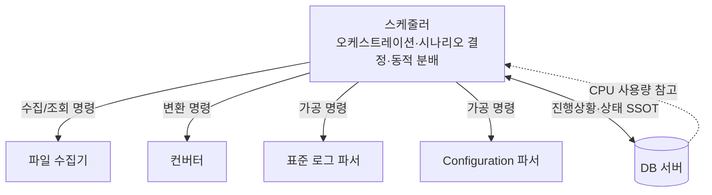
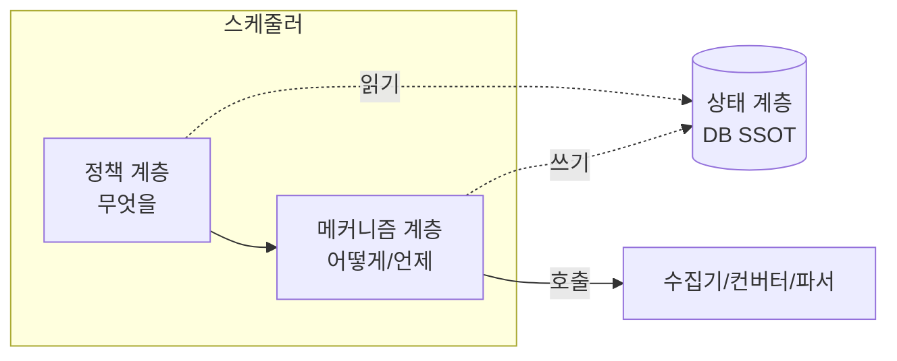
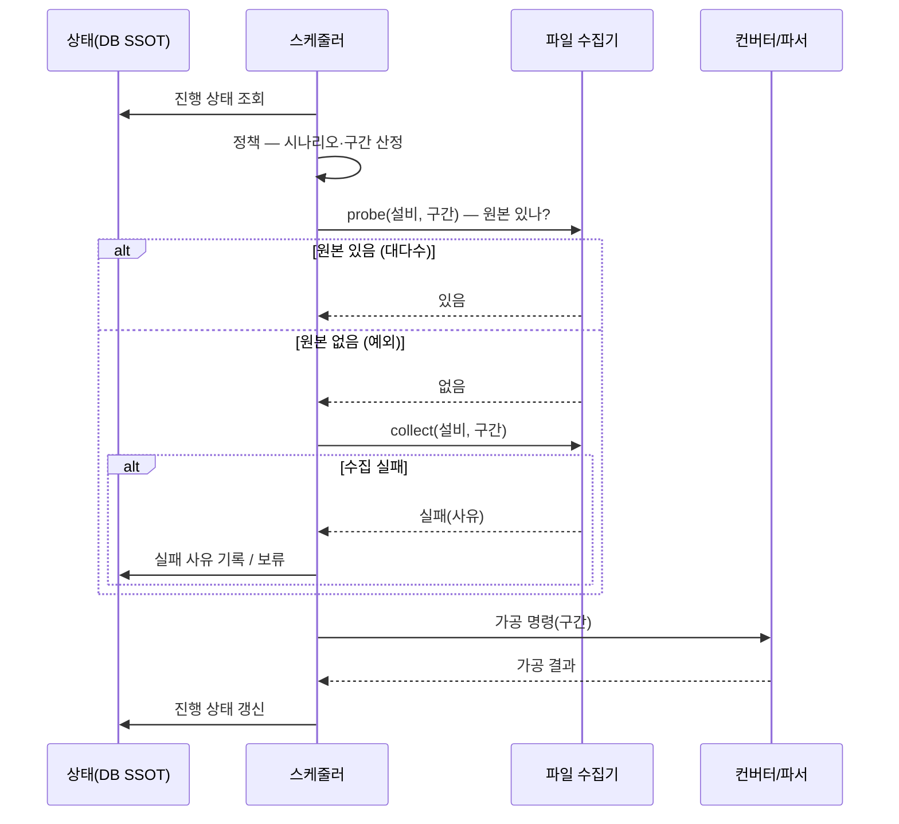
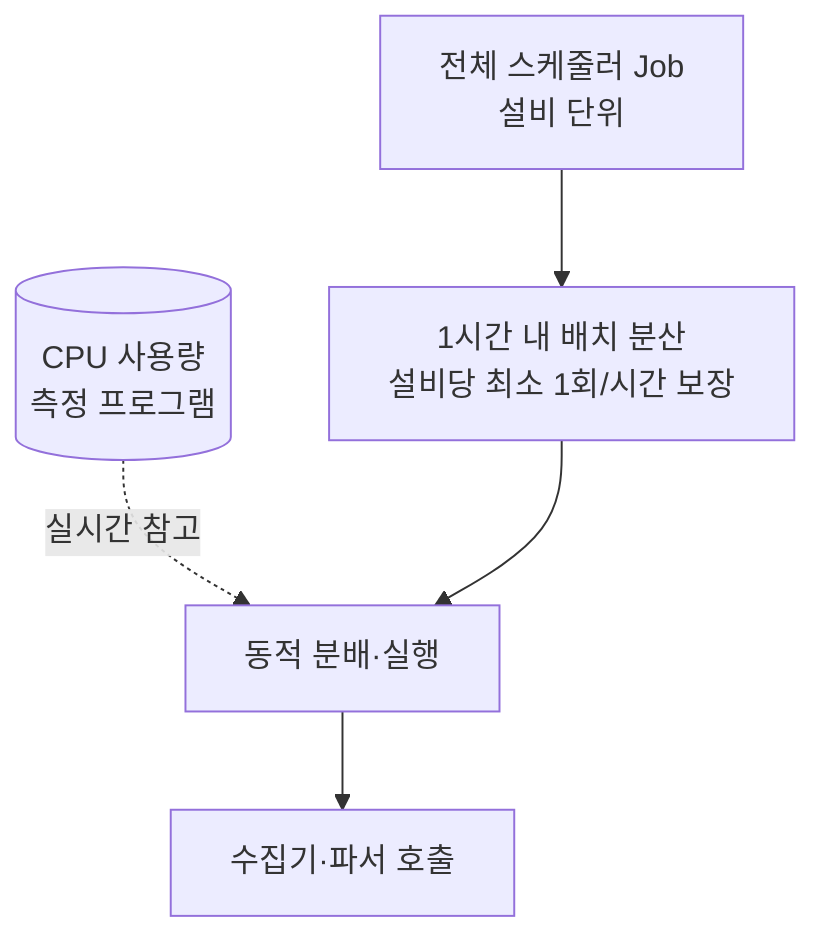

# 스케줄러 (Scheduler) 설계 문서

> 작성 목적: 「반도체 설비 이벤트 로그파서 개선 프로젝트」(이하 상위 문서)의 책임 분리 구조 중 **스케줄러** 컴포넌트만 떼어내어, 그 책임 경계·내부 계층·상호작용·동작을 구체화하기 위한 설계 자료.
>
> 본 문서는 상위 문서 `parser_project_revised.md`의 3.1①, 3.2, 4.1, 4.2, 4.3, 9장을 근거로 하며, 상위 문서와 충돌하는 내용이 생기면 상위 문서를 우선한다. 수집기와의 경계는 `file_collector_design.md`와 짝을 이룬다.

---

## 0. 한 줄 정의

> **스케줄러는 데이터 파이프라인 전체를 조정하는 컨트롤 타워다. "무엇을·언제·어떤 순서로·어떤 자원으로" 처리할지를 결정하고, 수집기·컨버터·파서를 호출하며, 진행 상태를 DB(SSOT)에 읽고 쓴다.**

스케줄러는 **정책(무엇을 처리할지)** 과 **메커니즘(어떻게/언제 실행할지)** 을 모두 책임지되, 이 둘과 **상태(진행 상황)** 를 내부에서 한 덩어리로 뭉치지 않고 계층으로 분리한다. 가공·변환·수집의 *실제 작업*은 하지 않는다 — 그것은 파서·컨버터·수집기의 몫이다.

---

## 1. 배경: 왜 컨트롤 타워가 필요한가

현재 파서는 범용 스케줄러에 의존하며, 다음 한계를 가진다(상위 문서 2.5, 2.6).

- **범용 스케줄러의 한계**: 파서 전용이 아니라 범용이고, 레거시·인수인계 미흡으로 파서에 맞게 수정하기 어렵다.
- **시나리오 대응 불가**: 재처리·하루치 순차 가공 등 다양한 운영 시나리오를 자동 처리하지 못해, 사람이 DB를 직접 손대는 수작업과 실수가 잦다.
- **순간 부하 피크**: 한 번 돌 때 전체 스케줄러 Job을 한꺼번에 처리해 부하가 피크를 찍고, 이후 자원을 놀린다. thread 개수 기반의 정적 제어라 유연하지 못하다.
- **프로세스 간 불균형**: 정해진 Job을 한 번에 분배해 각 프로세스가 독립 처리하므로, 어떤 프로세스는 일찍 끝나고 어떤 프로세스는 계속 돈다.

이 문제들의 공통 뿌리는 "*무엇을·어떻게 처리할지를 판단·조율하는 주체*"가 부재하거나 부적합하다는 데 있다. 책임이 분리된 새 구조에서는 수집기·파서·컨버터가 각자 "시나리오를 모르는 일꾼"이 되므로, 그들을 **시나리오에 맞게 엮는 컨트롤 타워**가 반드시 필요하다.

---

## 2. 책임 경계 (Scope)

### 2.1 스케줄러가 하는 일 (In Scope)

| 책임 | 설명 |
|------|------|
| **파이프라인 오케스트레이션** | 시나리오에 맞는 파일 구간을 정하고, 그에 맞는 프로그램(수집기·컨버터·파서)을 순서대로 호출하며, 필요한 DB 업데이트를 수행한다. |
| **시나리오 결정 (정책)** | live / rework / live 따라잡기 중 무엇을 적용할지 판단한다. |
| **처리 구간 산정 (정책)** | 시나리오와 진행 상태에 근거해 "어떤 설비의 어떤 구간을 어떤 순서로" 처리할지 정한다. |
| **원본 확보 조율** | 가공 전 원본 존재 여부를 수집기에 확인하고, 없으면 수집을 명령한다(`probe`→`collect`). |
| **진행 상태 관리** | 설비별로 "어디까지 처리했는지"를 DB 테이블(SSOT)에 읽고 쓴다. |
| **동적 부하 분산 (메커니즘)** | 실시간 CPU 사용량을 보고 스케줄러 Job을 동적으로 분배·실행한다. (기존 CPU 측정 프로그램 import 재사용) |
| **부하 평준화 (메커니즘)** | 전체 Job을 1시간 내 적절한 간격의 배치로 나눠, 순간 피크 없이 자원을 고르게 쓴다. 설비 단위로는 최소 한 시간에 한 번 가공을 보장한다. |
| **실패 처리 정책** | 수집·가공 실패 시 재시도/보류/기록 등 후속 조치를 결정한다. |

### 2.2 스케줄러가 하지 않는 일 (Out of Scope)

| 비책임 | 누가 하는가 | 이유 |
|--------|------------|------|
| 원본 다운로드·삭제·스냅샷 정리·변경 감지 | 파일 수집기 | 수집의 메커니즘은 수집기가 소유한다. 스케줄러는 명령·조회만 한다. |
| 로그 값 정규화·보정·start/end 병합 | 표준 로그 파서 | 가공 로직은 파서 도메인 내부. |
| 비표준→표준 변환 | 컨버터 | 변환 로직은 컨버터. |
| Configuration 파일 가공 | Configuration 파서 | 별도 파서. |
| 진행 상태를 자체 보유 | (상태는 DB가 SSOT) | 스케줄러는 상태를 읽고 쓰는 주체일 뿐, 자체적으로 보유하지 않는다. |

### 2.3 경계선 요약 그림

---

## 3. 내부 책임의 계층화

스케줄러는 역할이 큰 만큼, 내부 책임이 한 덩어리로 비대해지지 않도록 개념적으로 층을 나눈다(상위 문서 4.3). 과거 파서가 겪은 "한 곳에 책임 과집중" 문제를 스케줄러가 반복하지 않기 위함이다.

| 계층 | 질문 | 책임 | 비고 |
|------|------|------|------|
| **상태 계층 (State)** | "지금 어디까지 왔나?" | 진행 상황을 DB 테이블(SSOT)로 두고, 읽고 쓴다. 스케줄러는 상태를 자체 보유하지 않는다. | 4.1 상태 중앙화와 동일한 DB 테이블 |
| **정책 계층 (Policy)** | "무엇을 처리할까?" | 시나리오 판단(live/rework/따라잡기), 처리할 파일 구간 산정 등 "결정" 로직. | 3.2의 "정책" 역할과 동일 |
| **메커니즘 계층 (Mechanism)** | "어떻게/언제 실행할까?" | CPU 사용량 기반 분배, 배치 타이밍 등 "실행" 로직. | 4.2 자원 효율화와 직접 연결 |

**분리의 효과**: 정책과 메커니즘을 분리해 두면, 한쪽(예: 분배 알고리즘)을 바꿔도 다른 쪽(예: 시나리오 규칙)에 영향을 주지 않는다. 상태를 DB로 외부화해 두면, 스케줄러가 재시작되어도 진행 상황이 보존되고 사람도 같은 진실을 본다.

---

## 4. 가공 시나리오 (정책 계층)

시나리오는 "가공"의 축이며, 수집과 분리된다(상위 문서 3.2). 스케줄러는 아래 시나리오를 결정하고 그에 맞는 구간·순서를 산정한다.

| 시나리오 | 설명 | 정책 포인트 |
|----------|------|------------|
| **Live** | 아직 가공되지 않은 최신 파일을 가져와 가공하는 운영 기본 흐름 | 진행 상태 기준 "다음 미가공 구간"을 산정 |
| **Rework (재처리)** | 특정 구간·타겟(공정·모델·메이커 등)에서 문제 발생 시 해당 부분만 새로 가공 | 삭제 후 재적재 / upsert / 중복 방지 방식은 미정(10장) |
| **Live 따라잡기** | 가공이 하루~이틀 밀렸을 때 전체를 하루 단위씩 순차 가공해 설비별 속도를 고르게 맞춤 | 통계가 하루치 단위를 필요로 하므로 하루치씩 속도 정렬 |

**핵심 설계 원칙**: 세 시나리오의 차이는 "어떤 구간을 어떤 순서로 *가공*하느냐"일 뿐, "어떻게 *수집*하느냐"가 아니다. 따라서 스케줄러만 시나리오를 알고, 수집기·파서는 모른다.

---

## 5. 핵심 동작 흐름

### 5.1 가공 1건의 표준 흐름 (원본 확보 포함)

스케줄러는 가공 전 **원본의 존재 여부를 먼저 확인**하고, 있으면 바로 파서를, 없으면 그때 수집기에 수집을 명령한다(상위 문서 3.2).

일반 케이스(대다수)는 파일 유지 기간이 rework 기간보다 길어 원본이 거의 항상 로컬에 존재하므로 재수집 없이 바로 가공된다. 예외 케이스(서버 이전 등)는 별도 시나리오로 만들지 않고 "존재 확인 → 없으면 수집 → 실패 시 기록"의 공통 경로로 흡수한다.

### 5.2 부하 평준화·동적 분배 (메커니즘 계층)

- **배치 분산**: 전체 Job을 한꺼번에 돌리지 않고 1시간 내 적절한 간격의 배치로 나눠 순간 피크를 없앤다. 파이프라인은 끊임없이 돌되, 설비 단위로는 최소 한 시간에 한 번 가공을 보장한다.
- **동적 제어**: 정적 thread 설정값 대신 실시간 CPU 사용량을 직접 보고 분배한다. 기존 CPU 측정 프로그램을 import해 재사용한다.

---

## 6. 상태 중앙화 (상태 계층 / SSOT)

설비별 데이터 파이프라인의 진행 상황을 **DB 테이블 하나로 중앙 관리**하여 단일 진실 원천(SSOT)을 확보한다(상위 문서 4.1). 이 테이블이 4.3 "상태 계층"이 가리키는 바로 그 진실 원천이다.

- 설비별로 "어디까지 처리했는지"를 항상 명확히 파악한다.
- 재처리·하루치 순차 가공 등 시나리오를, 사람의 수작업이 아니라 스케줄러가 상태를 읽고 자동 수행한다.
- 비표준 carryover·Configuration처럼 파일로 흩어져 관리되던 상태도, 가능한 범위에서 중앙 관리 체계로 흡수한다.

> 스케줄러는 이 테이블의 **유일한 정상 쓰기 주체**를 지향한다. 사람이 DB를 직접 손대던 수작업을 스케줄러의 자동 상태 전이로 대체하는 것이 목표다.

---

## 7. 범위 및 단계 계획

상위 문서 9장에 따라, 올해 MVP에서 스케줄러는 **최소 기능만** 만든다. 가공 로직(컨버터+표준 파서) 신규 구축·검증이 MVP의 핵심이고, 스케줄러는 이를 구동해 파이프라인이 돌아가게 하는 수준으로 한정한다.

### 7.1 올해 (MVP) — 최소 기능

- 컨버터·표준 파서·수집기를 **호출해 파이프라인이 끝까지 돌아가게** 하는 수준
- live 흐름 기준의 기본 구간 산정·호출
- 원본 존재 확인 → 없으면 수집 명령의 기본 경로

> "비표준 로그 → 표준화 → 가공"이 최소 형태로 끝까지 이어지게 만드는 것이 목적이며, 운영 자동화 전체를 완성하지는 않는다.

### 7.2 차후 (고도화)

- 다양한 시나리오(rework, live 따라잡기) 오케스트레이션
- 진행 상황 상태 중앙화(SSOT) 정교화
- 동적 CPU 기반 부하 분산 및 배치 평준화 (4장 비기능 개선)
- 실패 분류·재시도 정책의 정교화

### 7.3 MVP에서의 설계 태도

고도화 기능을 지금 구현하지는 않되, **정책·메커니즘·상태 계층의 경계를 처음부터 지킨다.** 시나리오·분배 알고리즘이 나중에 들어올 자리를 비워 두고, 진행 상태는 처음부터 DB(SSOT)에 두어 스케줄러가 상태를 자체 보유하지 않도록 한다. 이로써 신규 스케줄러가 또 다른 "책임 과집중" 덩어리가 되는 것을 예방한다(상위 문서 리스크: 신규 스케줄러 복잡도).

---

## 8. 미정 사항

| 항목 | 현재 방향 | 추가 검토 필요 |
|------|-----------|----------------|
| **Rework 정책** | 특정 구간·타겟만 재가공 | 삭제 후 재적재 / upsert / 중복 방지 방식 (상위 문서 10장) |
| **상태 테이블 스키마** | 설비별 진행 상황 SSOT | 컬럼 구성, 상태 전이 정의, 잠금·동시성 처리 |
| **부하 제어 기준** | 초기에는 CPU 사용량 우선 | DB 부하·처리시간·큐 대기시간 등 추가 지표 반영 여부 (상위 문서 10장) |
| **배치 분산 알고리즘** | 1시간 내 균등 분산, 설비당 ≥1회/시간 | 구체 분배 규칙, 설비 우선순위, 따라잡기와의 상호작용 |
| **실패 재시도 정책** | 실패 사유 기록 후 보류/재시도 | 재시도 주체·횟수·백오프, 영구 실패 처리 |
| **carryover 중앙화 범위** | 가능한 범위에서 DB로 흡수 | 표준/비표준별 저장 위치·재처리 시 처리 (상위 문서 10장) |

---

> *본 문서는 상위 문서 및 `file_collector_design.md`와 함께 갱신된다. 정책·메커니즘 계층의 구체 알고리즘이 확정되면 4·5장을 실제 규칙으로 보강한다.*
